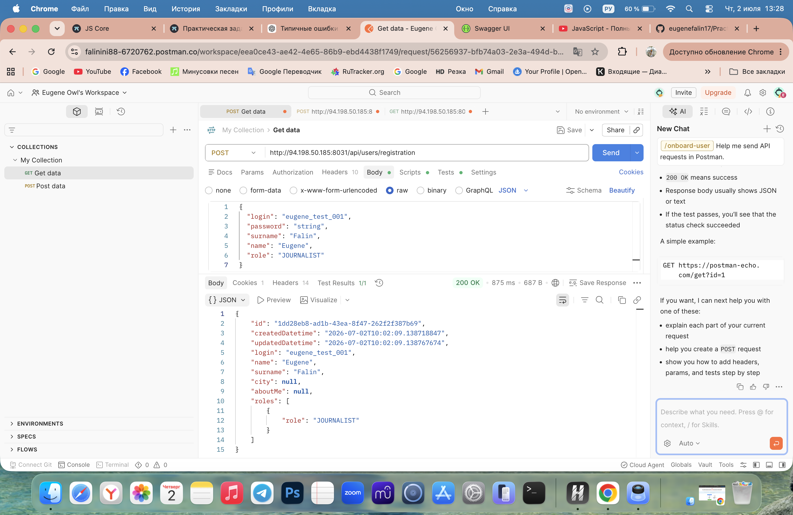
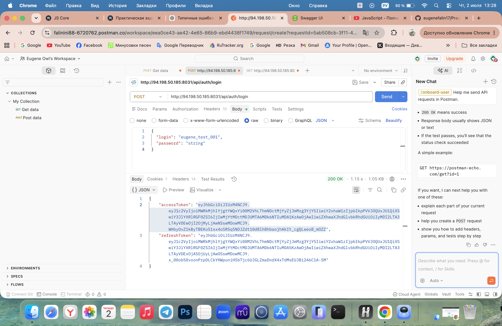
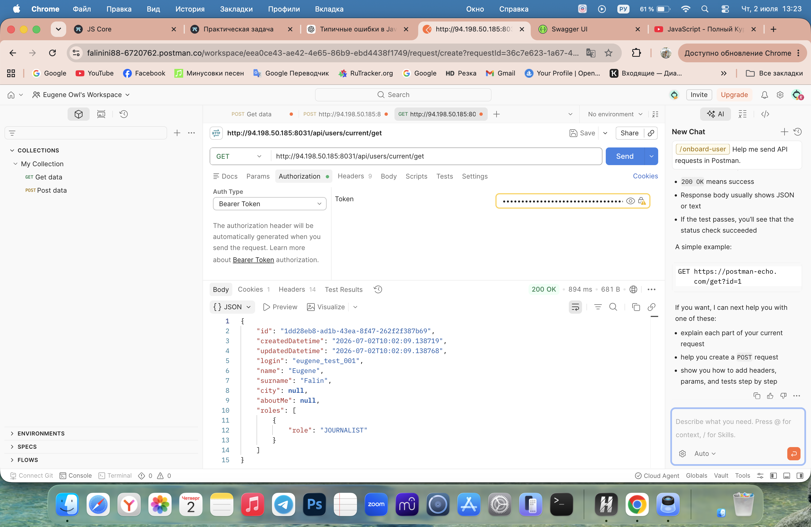

# Practice Task API

Практическая работа по изучению REST API и Postman.

## Выполнено

- Регистрация пользователя (`POST /api/users/registration`)
- Авторизация пользователя (`POST /api/auth/login`)
- Получение данных текущего пользователя (`GET /api/users/current/get`)
- Использование Bearer Token для авторизации

## API

**Base URL:** http://94.198.50.185:8031

**Swagger:** http://94.198.50.185:8031/swagger-ui/index.html#/

## Скриншоты

### Регистрация пользователя

### Авторизация

### Получение текущего пользователя

